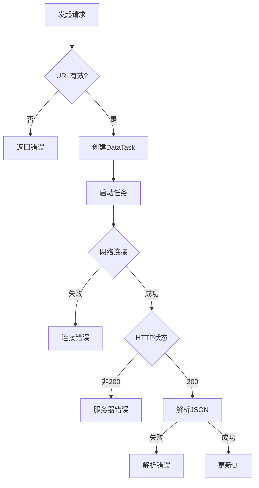

# 📡 iOS网络请求完整指南
> 基于PendantUI项目实战的iOS网络编程技术文档

## 📋 目录

- [1. 网络请求基础概念](#1-网络请求基础概念)
- [2. NSURLSession核心架构](#2-nsurlsession核心架构)
- [3. 完整的网络请求流程](#3-完整的网络请求流程)
- [4. 错误处理与异常机制](#4-错误处理与异常机制)
- [5. JSON数据解析技术](#5-json数据解析技术)
- [6. 线程管理与UI更新](#6-线程管理与ui更新)
- [7. 数据模型与绑定机制](#7-数据模型与绑定机制)
- [8. 网络请求最佳实践](#8-网络请求最佳实践)
- [9. 性能优化与安全考虑](#9-性能优化与安全考虑)
- [10. 调试技巧与工具](#10-调试技巧与工具)

---

## 1. 网络请求基础概念

### 🌐 HTTP协议基础

在iOS开发中，网络请求主要基于HTTP/HTTPS协议。理解HTTP的基本工作原理是掌握网络编程的前提。

#### **请求-响应模型**
```
[iOS客户端] ──HTTP请求──> [服务器]
     ↑                        ↓
[UI更新]   <──HTTP响应─── [数据处理]
```

#### **HTTP请求结构**
```http
GET /pendant-data HTTP/1.1
Host: 172.23.17.226:8080
Accept: application/json
User-Agent: PendantUI/1.0
Connection: keep-alive
```

#### **HTTP响应结构**
```http
HTTP/1.1 200 OK
Content-Type: application/json; charset=utf-8
Content-Length: 1024
Access-Control-Allow-Origin: *

{
  "firstPage": {
    "mainTitle": "🎤 全球歌王争霸",
    "userName": "音乐天才"
  }
}
```

### 📱 iOS网络编程历史

| 技术 | 时期 | 特点 | 状态 |
|------|------|------|------|
| `NSURLConnection` | iOS 2.0-9.0 | 同步/异步API | 已废弃 |
| `NSURLSession` | iOS 7.0+ | 现代化、功能强大 | **推荐使用** |
| 第三方库 | 持续 | AFNetworking、Alamofire等 | 可选 |

---

## 2. NSURLSession核心架构

### 🏗️ 基础架构组件
`NSURLSession` 是iOS网络编程的核心框架，提供了完整的网络请求解决方案。

#### **核心类关系图**
```
NSURLSession
    ├── NSURLSessionConfiguration (配置)
    ├── NSURLSessionTask (抽象任务基类)
    │   ├── NSURLSessionDataTask (数据任务)
    │   ├── NSURLSessionDownloadTask (下载任务)
    │   └── NSURLSessionUploadTask (上传任务)
    └── NSURLSessionDelegate (代理协议)
```

#### **在PendantUI项目中的实现**
```objectivec
// 网络配置常量
static NSString * const kServerBaseURL = @"http://172.23.17.226:8080";
static NSString * const kPendantDataEndpoint = @"/pendant-data";
static NSString * const kStatusEndpoint = @"/status";

@interface ViewController () <UIScrollViewDelegate>
// 网络相关属性
@property (nonatomic, strong) PendantDataModel *pendantData;
@property (nonatomic, strong) NSURLSession *networkSession;
@end
```

### ⚙️ NSURLSessionConfiguration详解

配置对象决定了网络会话的行为特性：

```objectivec
- (void)setupNetworking {
    // 创建会话配置
    NSURLSessionConfiguration *config = [NSURLSessionConfiguration defaultSessionConfiguration];
    
    // 超时设置
    config.timeoutIntervalForRequest = 10.0;  // 单次请求超时
    config.timeoutIntervalForResource = 30.0; // 资源获取超时
    
    // 缓存策略
    config.requestCachePolicy = NSURLRequestReloadIgnoringLocalCacheData;
    
    // 并发连接数
    config.HTTPMaximumConnectionsPerHost = 4;
    
    // 是否允许蜂窝网络
    config.allowsCellularAccess = YES;
    
    // 创建会话实例
    self.networkSession = [NSURLSession sessionWithConfiguration:config];
    NSLog(@"🔧 网络配置完成，服务器地址: %@", kServerBaseURL);
}
```

#### **配置类型对比**

| 配置类型 | 使用场景 | 特点 |
|----------|----------|------|
| `defaultSessionConfiguration` | 标准应用 | 支持缓存、Cookie、认证 |
| `ephemeralSessionConfiguration` | 隐私模式 | 内存中运行，不存储数据 |
| `backgroundSessionConfiguration` | 后台传输 | 应用不在前台时继续传输 |

---

## 3. 完整的网络请求流程

### 🔄 端到端请求流程

以PendantUI项目中的数据获取为例，展示完整的网络请求流程：

```objectivec
- (void)fetchPendantData {
    // ═══════════ 第1步：URL构建 ═══════════
    NSString *urlString = [NSString stringWithFormat:@"%@%@", kServerBaseURL, kPendantDataEndpoint];
    NSURL *url = [NSURL URLWithString:urlString];
    
    // URL有效性检查
    if (!url) {
        NSLog(@"❌ 无效的服务器URL: %@", urlString);
        return;
    }
    
    NSLog(@"🌐 正在从服务器获取数据: %@", urlString);
    
    // ═══════════ 第2步：创建网络任务 ═══════════
    NSURLSessionDataTask *dataTask = [self.networkSession dataTaskWithURL:url 
        completionHandler:^(NSData *data, NSURLResponse *response, NSError *error) {
        
        // ═══════════ 第3步：处理响应 ═══════════
        [self handleNetworkResponse:data response:response error:error];
    }];
    
    // ═══════════ 第4步：启动任务 ═══════════
    [dataTask resume];
}
```

### 📊 请求状态流转



### 🎯 具体实现步骤

#### **步骤1：URL构建与验证**
```objectivec
// 最佳实践：使用NSURLComponents构建复杂URL
- (NSURL *)buildURLWithEndpoint:(NSString *)endpoint parameters:(NSDictionary *)params {
    NSURLComponents *components = [[NSURLComponents alloc] initWithString:kServerBaseURL];
    components.path = endpoint;
    
    if (params.count > 0) {
        NSMutableArray *queryItems = [NSMutableArray array];
        for (NSString *key in params) {
            NSURLQueryItem *item = [NSURLQueryItem queryItemWithName:key value:params[key]];
            [queryItems addObject:item];
        }
        components.queryItems = queryItems;
    }
    
    return components.URL;
}
```

#### **步骤2：任务创建策略**
```objectivec
// GET请求（项目中使用）
NSURLSessionDataTask *getTask = [session dataTaskWithURL:url completionHandler:^{...}];

// POST请求示例
NSMutableURLRequest *postRequest = [NSMutableURLRequest requestWithURL:url];
postRequest.HTTPMethod = @"POST";
postRequest.HTTPBody = jsonData;
[postRequest setValue:@"application/json" forHTTPHeaderField:@"Content-Type"];
NSURLSessionDataTask *postTask = [session dataTaskWithRequest:postRequest completionHandler:^{...}];

// 文件上传示例
NSURLSessionUploadTask *uploadTask = [session uploadTaskWithRequest:request fromData:data completionHandler:^{...}];
```

#### **步骤3：响应处理流程**
```objectivec
- (void)handleNetworkResponse:(NSData *)data response:(NSURLResponse *)response error:(NSError *)error {
    // 检查网络错误
    if (error) {
        [self handleNetworkError:error];
        return;
    }
    
    // 检查HTTP状态码
    NSHTTPURLResponse *httpResponse = (NSHTTPURLResponse *)response;
    if (httpResponse.statusCode != 200) {
        [self handleHTTPError:httpResponse.statusCode];
        return;
    }
    
    // 解析响应数据
    [self parseResponseData:data];
}
```

---

## 4. 错误处理与异常机制

### 🚨 多层级错误处理

项目中实现了专业级的多层错误处理机制：

#### **错误分类体系**
typedef NS_ENUM(NSInteger, PendantNetworkErrorType) {
    PendantNetworkErrorTypeConnection = 1000,    // 连接相关错误
    PendantNetworkErrorTypeTimeout,              // 超时错误
    PendantNetworkErrorTypeHTTP,                 // HTTP状态码错误
    PendantNetworkErrorTypeJSON,                 // JSON解析错误
    PendantNetworkErrorTypeData,                 // 数据验证错误
    PendantNetworkErrorTypeUnknown               // 未知错误
};
```

#### **网络层错误处理**
```objectivec
- (void)handleNetworkError:(NSError *)error {
    NSLog(@"❌ 网络请求失败: %@", error.localizedDescription);
    
    // 分析错误类型
    NSString *errorMessage;
    switch (error.code) {
        case NSURLErrorTimedOut:
            errorMessage = @"请求超时，请检查网络连接";
            break;
        case NSURLErrorNotConnectedToInternet:
            errorMessage = @"无网络连接，请检查网络设置";
            break;
        case NSURLErrorCannotFindHost:
            errorMessage = @"无法找到服务器，请检查服务器地址";
            break;
        case NSURLErrorCannotConnectToHost:
            errorMessage = @"无法连接到服务器，请检查服务器状态";
            break;
        default:
            errorMessage = [NSString stringWithFormat:@"网络错误: %@", error.localizedDescription];
            break;
    }
    
    // 主线程显示错误提示
    dispatch_async(dispatch_get_main_queue(), ^{
        [self showErrorAlert:errorMessage canRetry:YES];
    });
}
```

#### **HTTP状态码处理**
```objectivec
- (void)handleHTTPError:(NSInteger)statusCode {
    NSLog(@"❌ 服务器响应错误，状态码: %ld", (long)statusCode);
    
    NSString *errorMessage;
    switch (statusCode) {
        case 400:
            errorMessage = @"请求参数错误";
            break;
        case 401:
            errorMessage = @"身份验证失败";
            break;
        case 403:
            errorMessage = @"访问被拒绝";
            break;
        case 404:
            errorMessage = @"请求的资源不存在";
            break;
        case 500:
            errorMessage = @"服务器内部错误";
            break;
        case 502:
            errorMessage = @"网关错误";
            break;
        case 503:
            errorMessage = @"服务暂时不可用";
            break;
        default:
            errorMessage = [NSString stringWithFormat:@"服务器错误 (%ld)", (long)statusCode];
            break;
    }
    
    dispatch_async(dispatch_get_main_queue(), ^{
        [self showErrorAlert:errorMessage canRetry:YES];
    });
}
```

#### **用户友好的错误界面**
```objectivec
- (void)showErrorAlert:(NSString *)message canRetry:(BOOL)canRetry {
    UIAlertController *alert = [UIAlertController 
        alertControllerWithTitle:@"网络请求失败"
        message:message
        preferredStyle:UIAlertControllerStyleAlert];
    
    if (canRetry) {
        UIAlertAction *retryAction = [UIAlertAction 
            actionWithTitle:@"重试" 
            style:UIAlertActionStyleDefault 
            handler:^(UIAlertAction *action) {
                [self fetchPendantData]; // 重新发起请求
            }];
        [alert addAction:retryAction];
    }
    
    UIAlertAction *cancelAction = [UIAlertAction 
        actionWithTitle:@"取消" 
        style:UIAlertActionStyleCancel 
        handler:nil];
    [alert addAction:cancelAction];
    
    [self presentViewController:alert animated:YES completion:nil];
}
```

---

## 5. JSON数据解析技术

### 📄 JSON解析核心流程

#### **系统级JSON解析**
```objectivec
- (void)parseResponseData:(NSData *)data {
    NSError *parseError;
    NSDictionary *jsonData = [NSJSONSerialization JSONObjectWithData:data 
                                                             options:0 
                                                               error:&parseError];
    if (parseError) {
        NSLog(@"❌ JSON解析失败: %@", parseError.localizedDescription);
        return;
    }
    
    NSLog(@"✅ 成功获取服务器数据");
    NSLog(@"📄 数据内容: %@", jsonData);
    
    // 切换到主线程更新UI
    dispatch_async(dispatch_get_main_queue(), ^{
        [self updateDataModel:jsonData];
        [self updateUIWithNewData];
    });
}
```

#### **数据结构映射**

**服务器JSON结构：**
```json
{
  "firstPage": {
    "mainTitle": "🎤 全球歌王争霸",
    "userName": "音乐天才",
    "userTitle": "🏆 世界冠军"
  },
  "secondPage": {
    "challengeTitle": "🎯 终极挑战",
    "progressText": "距离目标还差 25000 分",
    "rewardText": "🎁 豪华奖励等你拿 >",
    "progressValue": 0.75
  },
  "bottomBar": {
    "eventTitle": "2025新春音乐节"
  },
  "metadata": {
    "timestamp": "2025-01-21T10:05:09.000Z",
    "version": "1.0.0"
  }
}
```

**Objective-C数据模型：**
```objectivec
@interface PendantDataModel : NSObject
// 第一页数据
@property (nonatomic, strong) NSString *mainTitle;
@property (nonatomic, strong) NSString *userName;
@property (nonatomic, strong) NSString *userTitle;

// 第二页数据
@property (nonatomic, strong) NSString *challengeTitle;
@property (nonatomic, strong) NSString *progressText;
@property (nonatomic, strong) NSString *rewardText;
@property (nonatomic, assign) CGFloat progressValue;

// 底部栏数据
@property (nonatomic, strong) NSString *eventTitle;
@end
```

#### **安全的数据提取**
```objectivec
- (void)updateDataModel:(NSDictionary *)jsonData {
    if (!jsonData || ![jsonData isKindOfClass:[NSDictionary class]]) {
        NSLog(@"❌ 无效的JSON数据");
        return;
    }
    
    // 安全提取第一页数据
    NSDictionary *firstPage = [self safeDictionaryFromJSON:jsonData key:@"firstPage"];
    if (firstPage) {
        self.pendantData.mainTitle = [self safeStringFromJSON:firstPage 
                                                          key:@"mainTitle" 
                                                 defaultValue:self.pendantData.mainTitle];
        self.pendantData.userName = [self safeStringFromJSON:firstPage 
                                                         key:@"userName" 
                                                defaultValue:self.pendantData.userName];
        self.pendantData.userTitle = [self safeStringFromJSON:firstPage 
                                                          key:@"userTitle" 
                                                 defaultValue:self.pendantData.userTitle];
    }
    
    // 安全提取第二页数据
    NSDictionary *secondPage = [self safeDictionaryFromJSON:jsonData key:@"secondPage"];
    if (secondPage) {
        self.pendantData.challengeTitle = [self safeStringFromJSON:secondPage 
                                                               key:@"challengeTitle" 
                                                      defaultValue:self.pendantData.challengeTitle];
        self.pendantData.progressText = [self safeStringFromJSON:secondPage 
                                                             key:@"progressText" 
                                                    defaultValue:self.pendantData.progressText];
        self.pendantData.rewardText = [self safeStringFromJSON:secondPage 
                                                           key:@"rewardText" 
                                                  defaultValue:self.pendantData.rewardText];
        
        // 数值类型的安全提取
        NSNumber *progressValue = [self safeNumberFromJSON:secondPage key:@"progressValue"];
        if (progressValue) {
            self.pendantData.progressValue = [progressValue floatValue];
        }
    }
    
    // 安全提取底部栏数据
    NSDictionary *bottomBar = [self safeDictionaryFromJSON:jsonData key:@"bottomBar"];
    if (bottomBar) {
        self.pendantData.eventTitle = [self safeStringFromJSON:bottomBar 
                                                           key:@"eventTitle" 
                                                  defaultValue:self.pendantData.eventTitle];
    }
    
    NSLog(@"📱 数据模型更新完成");
}

#pragma mark - 安全数据提取工具方法

- (NSDictionary *)safeDictionaryFromJSON:(NSDictionary *)json key:(NSString *)key {
    id value = json[key];
    return [value isKindOfClass:[NSDictionary class]] ? (NSDictionary *)value : nil;
}

- (NSString *)safeStringFromJSON:(NSDictionary *)json key:(NSString *)key defaultValue:(NSString *)defaultValue {
    id value = json[key];
    if ([value isKindOfClass:[NSString class]]) {
        return (NSString *)value;
    } else if ([value isKindOfClass:[NSNumber class]]) {
        return [(NSNumber *)value stringValue]; // 数字转字符串
    }
    return defaultValue;
}

- (NSNumber *)safeNumberFromJSON:(NSDictionary *)json key:(NSString *)key {
    id value = json[key];
    if ([value isKindOfClass:[NSNumber class]]) {
        return (NSNumber *)value;
    } else if ([value isKindOfClass:[NSString class]]) {
        NSNumberFormatter *formatter = [[NSNumberFormatter alloc] init];
        return [formatter numberFromString:(NSString *)value]; // 字符串转数字
    }
    return nil;
}
```

### 🔄 高级JSON处理技巧
#### **JSON Schema验证**
```objectivec
- (BOOL)validateJSONSchema:(NSDictionary *)json {
    // 检查必要字段
    NSArray *requiredKeys = @[@"firstPage", @"secondPage", @"bottomBar"];
    for (NSString *key in requiredKeys) {
        if (!json[key]) {
            NSLog(@"❌ JSON缺少必要字段: %@", key);
            return NO;
        }
    }
    
    // 检查数据类型
    if (![json[@"firstPage"] isKindOfClass:[NSDictionary class]]) {
        NSLog(@"❌ firstPage字段类型错误");
        return NO;
    }
    
    return YES;
}
```

#### **JSON缓存机制**
```objectivec
- (void)cacheJSONData:(NSDictionary *)jsonData {
    NSError *error;
    NSData *data = [NSJSONSerialization dataWithJSONObject:jsonData options:NSJSONWritingPrettyPrinted error:&error];
    
    if (!error) {
        NSString *cachePath = [self getJSONCachePath];
        [data writeToFile:cachePath atomically:YES];
        NSLog(@"📦 JSON数据已缓存");
    }
}

- (NSDictionary *)loadCachedJSONData {
    NSString *cachePath = [self getJSONCachePath];
    NSData *data = [NSData dataWithContentsOfFile:cachePath];
    
    if (data) {
        NSError *error;
        NSDictionary *json = [NSJSONSerialization JSONObjectWithData:data options:0 error:&error];
        if (!error) {
            NSLog(@"📦 使用缓存的JSON数据");
            return json;
        }
    }
    
    return nil;
}
```

---

## 6. 线程管理与UI更新

### 🧵 线程模型理解

iOS应用的线程模型遵循严格的规则：**所有UI操作必须在主线程进行**。

#### **线程分工**
```objectivec
// 网络请求在后台线程执行
NSURLSessionDataTask *task = [session dataTaskWithURL:url completionHandler:^(NSData *data, NSURLResponse *response, NSError *error) {
    // 📍 当前在后台线程
    NSLog(@"当前线程: %@", [NSThread currentThread]);
    
    // ❌ 错误：直接在后台线程更新UI
    // self.label.text = @"更新文本"; // 这会导致不可预期的行为
    
    // ✅ 正确：切换到主线程更新UI
    dispatch_async(dispatch_get_main_queue(), ^{
        // 📍 现在在主线程
        self.label.text = @"更新文本"; // 安全的UI更新
    });
}];
```

#### **项目中的线程管理实践**
```objectivec
- (void)updateUIWithNewData {
    // 📍 确保在主线程执行
    NSAssert([NSThread isMainThread], @"UI更新必须在主线程进行");
    // 更新第一页标签
    if (self.mainTitleLabel) {
        self.mainTitleLabel.text = self.pendantData.mainTitle;
        NSLog(@"🔄 更新主标题: %@", self.pendantData.mainTitle);
    }
    
    if (self.userNameLabel) {
        self.userNameLabel.text = self.pendantData.userName;
        NSLog(@"🔄 更新用户名: %@", self.pendantData.userName);
    }
    
    if (self.userTitleLabel) {
        self.userTitleLabel.text = self.pendantData.userTitle;
        NSLog(@"🔄 更新用户头衔: %@", self.pendantData.userTitle);
    }
    
    // 更新第二页标签
    if (self.challengeTitleLabel) {
        self.challengeTitleLabel.text = self.pendantData.challengeTitle;
        NSLog(@"🔄 更新挑战标题: %@", self.pendantData.challengeTitle);
    }
    
    if (self.progressTextLabel) {
        self.progressTextLabel.text = self.pendantData.progressText;
        NSLog(@"🔄 更新进度文本: %@", self.pendantData.progressText);
    }
    
    if (self.rewardTextLabel) {
        self.rewardTextLabel.text = self.pendantData.rewardText;
        NSLog(@"🔄 更新奖励文本: %@", self.pendantData.rewardText);
    }
    
    // 更新底部栏
    if (self.eventTitleLabel) {
        self.eventTitleLabel.text = self.pendantData.eventTitle;
        NSLog(@"🔄 更新活动标题: %@", self.pendantData.eventTitle);
    }
    
    NSLog(@"✅ UI更新完成");
}
```

### ⚡ 高级线程管理技术

#### **批量UI更新**
```objectivec
- (void)performBatchUIUpdates:(void(^)(void))updates {
    dispatch_async(dispatch_get_main_queue(), ^{
        [UIView performWithoutAnimation:^{
            updates();
        }];
    });
}

// 使用示例
[self performBatchUIUpdates:^{
    self.label1.text = @"文本1";
    self.label2.text = @"文本2";
    self.label3.text = @"文本3";
}];
```

#### **防止频繁更新**
```objectivec
@property (nonatomic, strong) NSTimer *updateTimer;

- (void)scheduleUIUpdate {
    // 取消之前的定时器
    [self.updateTimer invalidate];
    
    // 延迟更新，避免频繁刷新
    self.updateTimer = [NSTimer scheduledTimerWithTimeInterval:0.1 
                                                       target:self 
                                                     selector:@selector(performScheduledUpdate) 
                                                     userInfo:nil 
                                                      repeats:NO];
}

- (void)performScheduledUpdate {
    dispatch_async(dispatch_get_main_queue(), ^{
        [self updateUIWithNewData];
    });
}
```

#### **线程安全的数据访问**
```objectivec
@interface PendantDataModel ()
@property (nonatomic, strong) dispatch_queue_t dataQueue;
@end

@implementation PendantDataModel

- (instancetype)init {
    if (self = [super init]) {
        _dataQueue = dispatch_queue_create("com.pendantui.data", DISPATCH_QUEUE_CONCURRENT);
    }
    return self;
}

- (void)setMainTitle:(NSString *)mainTitle {
    dispatch_barrier_async(self.dataQueue, ^{
        _mainTitle = [mainTitle copy];
    });
}

- (NSString *)mainTitle {
    __block NSString *title;
    dispatch_sync(self.dataQueue, ^{
        title = _mainTitle;
    });
    return title;
}

@end
```

---
## 7. 数据模型与绑定机制

### 📊 数据驱动架构

项目采用了现代的数据驱动UI架构，实现了数据与界面的解耦。

#### **数据流向**
```
[服务器数据] → [JSON解析] → [数据模型] → [UI绑定] → [界面显示]
      ↑                                              ↓
[网络请求] ← [用户操作] ← [界面交互] ← [事件处理] ← [用户输入]
```

#### **数据模型设计**
@interface PendantDataModel : NSObject

#pragma mark - 数据属性
// 第一页用户信息
@property (nonatomic, strong) NSString *mainTitle;
@property (nonatomic, strong) NSString *userName;
@property (nonatomic, strong) NSString *userTitle;

// 第二页挑战信息
@property (nonatomic, strong) NSString *challengeTitle;
@property (nonatomic, strong) NSString *progressText;
@property (nonatomic, strong) NSString *rewardText;
@property (nonatomic, assign) CGFloat progressValue;
// 公共信息
@property (nonatomic, strong) NSString *eventTitle;

#pragma mark - 便利方法
- (void)updateWithJSONData:(NSDictionary *)jsonData;
- (NSDictionary *)toDictionary;
- (BOOL)isValid;

@end

@implementation PendantDataModel

- (instancetype)init {
    if (self = [super init]) {
        // 设置默认值
        [self setDefaultValues];
    }
    return self;
}

- (void)setDefaultValues {
    self.mainTitle = @"唱歌十强争夺";
    self.userName = @"沾沾";
    self.userTitle = @"巅峰冠军";
    self.challengeTitle = @"心愿挑战";
    self.progressText = @"心愿值还差 50000";
    self.rewardText = @"玩法奖励抢先看 >";
    self.eventTitle = @"2024秋季盛典";
    self.progressValue = 0.7;
}

- (BOOL)isValid {
    return self.mainTitle.length > 0 && 
           self.userName.length > 0 && 
           self.eventTitle.length > 0;
}

- (NSDictionary *)toDictionary {
    return @{
        @"firstPage": @{
            @"mainTitle": self.mainTitle ?: @"",
            @"userName": self.userName ?: @"",
            @"userTitle": self.userTitle ?: @""
        },
        @"secondPage": @{
            @"challengeTitle": self.challengeTitle ?: @"",
            @"progressText": self.progressText ?: @"",
            @"rewardText": self.rewardText ?: @"",
            @"progressValue": @(self.progressValue)
        },
        @"bottomBar": @{
            @"eventTitle": self.eventTitle ?: @""
        }
    };
}

@end
```

### 🔗 数据绑定机制

#### **UI标签引用管理**
```objectivec
@interface ViewController ()
// UI元素引用，用于动态更新
@property (nonatomic, strong) UILabel *mainTitleLabel;
@property (nonatomic, strong) UILabel *userNameLabel;
@property (nonatomic, strong) UILabel *userTitleLabel;
@property (nonatomic, strong) UILabel *challengeTitleLabel;
@property (nonatomic, strong) UILabel *progressTextLabel;
@property (nonatomic, strong) UILabel *rewardTextLabel;
@property (nonatomic, strong) UILabel *eventTitleLabel;
@end
```

#### **数据绑定策略**
```objectivec
// 标签创建时绑定数据
self.mainTitleLabel = [self createCustomLabelWithText:self.pendantData.mainTitle
                                             fontSize:11 
                                                width:91 
                                               height:20 
                                                  top:19 
                                                color:[UIColor whiteColor] 
                                               parent:firstPageView];

// 数据更新时重新绑定
- (void)bindDataToUI {
    NSArray *bindings = @[
        @{@"label": self.mainTitleLabel, @"keyPath": @"mainTitle"},
        @{@"label": self.userNameLabel, @"keyPath": @"userName"},
        @{@"label": self.userTitleLabel, @"keyPath": @"userTitle"},
        @{@"label": self.challengeTitleLabel, @"keyPath": @"challengeTitle"},
        @{@"label": self.progressTextLabel, @"keyPath": @"progressText"},
        @{@"label": self.rewardTextLabel, @"keyPath": @"rewardText"},
        @{@"label": self.eventTitleLabel, @"keyPath": @"eventTitle"}
    ];
    
    for (NSDictionary *binding in bindings) {
        UILabel *label = binding[@"label"];
        NSString *keyPath = binding[@"keyPath"];
        
        if (label) {
            NSString *value = [self.pendantData valueForKey:keyPath];
            label.text = value;
            NSLog(@"🔗 绑定数据: %@ = %@", keyPath, value);
        }
    }
}
```

#### **KVO数据监听**
```objectivec
// 监听数据模型变化
- (void)observeDataModel {
    [self.pendantData addObserver:self 
                       forKeyPath:@"mainTitle"
                          options:NSKeyValueObservingOptionNew 
                          context:NULL];
    // 添加其他属性监听...
}

- (void)observeValueForKeyPath:(NSString *)keyPath 
                      ofObject:(id)object 
                        change:(NSDictionary *)change 
                       context:(void *)context {
    if ([keyPath isEqualToString:@"mainTitle"]) {
        dispatch_async(dispatch_get_main_queue(), ^{
            self.mainTitleLabel.text = self.pendantData.mainTitle;
        });
    }
    // 处理其他属性变化...
}

- (void)dealloc {
    [self.pendantData removeObserver:self forKeyPath:@"mainTitle"];
    // 移除其他监听...
}
```

---

## 8. 网络请求最佳实践

### 🏆 专业级实现标准

#### **1. 请求管理器设计**
```objectivec
@interface PendantNetworkManager : NSObject

+ (instancetype)sharedManager;

// 基础网络请求方法
- (void)requestWithEndpoint:(NSString *)endpoint
                 parameters:(NSDictionary *)parameters
                     method:(NSString *)method
                    success:(void(^)(NSDictionary *data))success
                    failure:(void(^)(NSError *error))failure;

// 专用数据请求方法
- (void)fetchPendantDataWithSuccess:(void(^)(PendantDataModel *data))success
                            failure:(void(^)(NSError *error))failure;

// 请求取消和管理
- (void)cancelAllRequests;
- (void)cancelRequestWithIdentifier:(NSString *)identifier;

@end

@implementation PendantNetworkManager

+ (instancetype)sharedManager {
    static PendantNetworkManager *manager = nil;
    static dispatch_once_t onceToken;
    dispatch_once(&onceToken, ^{
        manager = [[PendantNetworkManager alloc] init];
    });
    return manager;
}

- (instancetype)init {
    if (self = [super init]) {
        [self setupNetworkConfiguration];
        self.activeTasks = [NSMutableDictionary dictionary];
    }
    return self;
}

- (void)setupNetworkConfiguration {
    NSURLSessionConfiguration *config = [NSURLSessionConfiguration defaultSessionConfiguration];
    config.timeoutIntervalForRequest = 10.0;
    config.timeoutIntervalForResource = 30.0;
    config.HTTPMaximumConnectionsPerHost = 4;
    
    // 添加通用请求头
    config.HTTPAdditionalHeaders = @{
        @"User-Agent": @"PendantUI/1.0",
        @"Accept": @"application/json",
        @"Accept-Language": @"zh-CN,zh;q=0.9,en;q=0.8"
    };
    
    self.session = [NSURLSession sessionWithConfiguration:config];
}

@end
```

#### **2. 请求重试机制**
```objectivec
@interface PendantNetworkManager ()
@property (nonatomic, assign) NSInteger maxRetryCount;
@property (nonatomic, assign) NSTimeInterval retryDelay;
@end

- (void)requestWithRetry:(NSURLRequest *)request
              retryCount:(NSInteger)retryCount
                 success:(void(^)(NSDictionary *data))success
                 failure:(void(^)(NSError *error))failure {
    
    NSURLSessionDataTask *task = [self.session dataTaskWithRequest:request 
        completionHandler:^(NSData *data, NSURLResponse *response, NSError *error) {
        
        if (error && retryCount > 0) {
            // 检查是否为可重试的错误
            if ([self shouldRetryForError:error]) {
                NSLog(@"🔄 请求失败，%ld秒后重试 (剩余重试次数: %ld)", 
                      (long)self.retryDelay, (long)retryCount - 1);
                
                dispatch_after(dispatch_time(DISPATCH_TIME_NOW, (int64_t)(self.retryDelay * NSEC_PER_SEC)), 
                              dispatch_get_main_queue(), ^{
                    [self requestWithRetry:request 
                                retryCount:retryCount - 1 
                                   success:success 
                                   failure:failure];
                });
                return;
            }
        }
        
        // 处理最终结果
        [self handleFinalResponse:data response:response error:error success:success failure:failure];
    }];
    
    [task resume];
}

- (BOOL)shouldRetryForError:(NSError *)error {
    // 定义可重试的错误类型
    NSArray *retryableErrorCodes = @[
        @(NSURLErrorTimedOut),
        @(NSURLErrorNetworkConnectionLost),
        @(NSURLErrorNotConnectedToInternet)
    ];
    
    return [retryableErrorCodes containsObject:@(error.code)];
}
```

#### **3. 网络状态监控**
```objectivec
#import <SystemConfiguration/SystemConfiguration.h>

@interface PendantNetworkManager ()
@property (nonatomic, assign) SCNetworkReachabilityRef reachability;
@property (nonatomic, assign) BOOL isNetworkAvailable;
@end

- (void)startNetworkMonitoring {
    self.reachability = SCNetworkReachabilityCreateWithName(NULL, "www.apple.com");
    SCNetworkReachabilityContext context = {0, (__bridge void *)self, NULL, NULL, NULL};
    SCNetworkReachabilitySetCallback(self.reachability, NetworkReachabilityCallback, &context);
    SCNetworkReachabilityScheduleWithRunLoop(self.reachability, CFRunLoopGetCurrent(), kCFRunLoopDefaultMode);
}

static void NetworkReachabilityCallback(SCNetworkReachabilityRef target, SCNetworkReachabilityFlags flags, void *info) {
    PendantNetworkManager *manager = (__bridge PendantNetworkManager *)info;
    BOOL isReachable = flags & kSCNetworkReachabilityFlagsReachable;
    
    dispatch_async(dispatch_get_main_queue(), ^{
        manager.isNetworkAvailable = isReachable;
        [[NSNotificationCenter defaultCenter] postNotificationName:@"NetworkStatusChanged" 
                                                            object:@(isReachable)];
    });
}
```

#### **4. 请求缓存策略**
```objectivec
@interface PendantCache : NSObject
+ (instancetype)sharedCache;
- (void)setObject:(id)object forKey:(NSString *)key maxAge:(NSTimeInterval)maxAge;
- (id)objectForKey:(NSString *)key;
- (BOOL)hasValidCacheForKey:(NSString *)key;
@end

- (void)fetchPendantDataWithCachePolicy:(PendantCachePolicy)cachePolicy
                                success:(void(^)(PendantDataModel *data, BOOL fromCache))success
                                failure:(void(^)(NSError *error))failure {
    NSString *cacheKey = @"pendant_data";
    
    // 检查缓存策略
    if (cachePolicy == PendantCachePolicyCacheFirst) {
        if ([[PendantCache sharedCache] hasValidCacheForKey:cacheKey]) {
            NSDictionary *cachedData = [[PendantCache sharedCache] objectForKey:cacheKey];
            PendantDataModel *model = [[PendantDataModel alloc] initWithDictionary:cachedData];
            success(model, YES);
            return;
        }
    }
    // 发起网络请求
    [self fetchPendantDataWithSuccess:^(PendantDataModel *data) {
        // 缓存数据
        [[PendantCache sharedCache] setObject:[data toDictionary] 
                                       forKey:cacheKey 
                                       maxAge:300]; // 5分钟缓存
        success(data, NO);
    } failure:failure];
}
```

---

## 9. 性能优化与安全考虑
### ⚡ 性能优化策略

#### **1. 连接池管理**
```objectivec
// 优化并发连接数
config.HTTPMaximumConnectionsPerHost = 4;
config.HTTPShouldUsePipelining = YES;

// 启用HTTP/2支持
config.HTTPShouldSetCookies = YES;
config.HTTPCookieAcceptPolicy = NSHTTPCookieAcceptPolicyAlways;
```

#### **2. 数据压缩**
```objectivec
// 请求压缩
[request setValue:@"gzip, deflate" forHTTPHeaderField:@"Accept-Encoding"];

// 响应解压缩
- (NSData *)decompressData:(NSData *)compressedData {
    if (compressedData.length == 0) return compressedData;
    
    z_stream stream;
    stream.next_in = (Bytef *)compressedData.bytes;
    stream.avail_in = (uint)compressedData.length;
    stream.total_out = 0;
    stream.zalloc = Z_NULL;
    stream.zfree = Z_NULL;
    if (inflateInit2(&stream, 15 + 32) != Z_OK) return nil;
    
    NSMutableData *decompressed = [NSMutableData dataWithLength:compressedData.length * 2];
    // 解压缩逻辑...
    
    return decompressed;
}
```

#### **3. 内存管理优化**
```objectivec
// 使用autoreleasepool减少内存峰值
- (void)processLargeDataSet:(NSArray *)dataSet {
    for (NSDictionary *item in dataSet) {
        @autoreleasepool {
            [self processItem:item];
        }
    }
}

// 及时释放大型对象
- (void)handleLargeResponse:(NSData *)data {
    NSDictionary *json = [NSJSONSerialization JSONObjectWithData:data options:0 error:nil];
    [self processJSON:json];
    
    // 清空引用，帮助ARC及时释放内存
    data = nil;
    json = nil;
}
```

### 🔒 安全考虑

#### **1. HTTPS强制使用**
```objectivec
// Info.plist配置
<key>NSAppTransportSecurity</key>
<dict>
    <key>NSAllowsArbitraryLoads</key>
    <false/>
    <key>NSExceptionDomains</key>
    <dict>
        <key>your-api-domain.com</key>
        <dict>
            <key>NSExceptionRequiresForwardSecrecy</key>
            <false/>
            <key>NSExceptionMinimumTLSVersion</key>
            <string>TLSv1.2</string>
        </dict>
    </dict>
</dict>

// 代码中验证HTTPS
- (BOOL)isSecureURL:(NSURL *)url {
    return [url.scheme.lowercaseString isEqualToString:@"https"];
}
```

#### **2. 证书锁定**
```objectivec
- (void)URLSession:(NSURLSession *)session
              task:(NSURLSessionTask *)task
didReceiveChallenge:(NSURLAuthenticationChallenge *)challenge
 completionHandler:(void (^)(NSURLSessionAuthChallengeDisposition, NSURLCredential *))completionHandler {
    
    // 获取服务器证书
    SecTrustRef serverTrust = challenge.protectionSpace.serverTrust;
    SecCertificateRef serverCertificate = SecTrustGetCertificateAtIndex(serverTrust, 0);
    
    // 获取本地证书
    NSString *certPath = [[NSBundle mainBundle] pathForResource:@"server-cert" ofType:@"cer"];
    NSData *localCertData = [NSData dataWithContentsOfFile:certPath];
    SecCertificateRef localCertificate = SecCertificateCreateWithData(NULL, (__bridge CFDataRef)localCertData);
    
    // 比较证书
    NSData *serverCertData = (__bridge NSData *)SecCertificateCopyData(serverCertificate);
    NSData *localCertDataFromRef = (__bridge NSData *)SecCertificateCopyData(localCertificate);
    
    if ([serverCertData isEqualToData:localCertDataFromRef]) {
        // 证书匹配，接受连接
        NSURLCredential *credential = [NSURLCredential credentialForTrust:serverTrust];
        completionHandler(NSURLSessionAuthChallengeUseCredential, credential);
    } else {
        // 证书不匹配，拒绝连接
        completionHandler(NSURLSessionAuthChallengeRejectProtectionSpace, nil);
    }
    
    if (localCertificate) CFRelease(localCertificate);
}
```

#### **3. 输入验证与防护**
```objectivec
// URL注入防护
- (NSURL *)sanitizeURL:(NSString *)urlString {
    // 移除危险字符
    NSCharacterSet *dangerousChars = [NSCharacterSet characterSetWithCharactersInString:@"<>\"'&;"];
    NSString *cleanString = [[urlString componentsSeparatedByCharactersInSet:dangerousChars] 
                            componentsJoinedByString:@""];
    
    // 验证URL格式
    NSURL *url = [NSURL URLWithString:cleanString];
    if (!url || ![self isValidDomain:url.host]) {
        return nil;
    }
    
    return url;
}

// 数据验证
- (BOOL)validateJSONData:(NSDictionary *)json {
    // 检查数据完整性
    if (!json || ![json isKindOfClass:[NSDictionary class]]) {
        return NO;
    }
    
    // 检查关键字段
    if (!json[@"firstPage"] || !json[@"secondPage"]) {
        return NO;
    }
    
    // 检查数据长度限制
    NSString *mainTitle = json[@"firstPage"][@"mainTitle"];
    if (mainTitle.length > 100) { // 限制标题长度
        return NO;
    }
    
    return YES;
}
```

---

## 10. 调试技巧与工具

### 🔍 调试技术

#### **1. 网络请求日志系统**
```objectivec
// 详细的网络日志
typedef NS_ENUM(NSInteger, PendantLogLevel) {
    PendantLogLevelError = 0,
    PendantLogLevelWarning,
    PendantLogLevelInfo,
    PendantLogLevelDebug
};

@interface PendantLogger : NSObject
+ (void)logLevel:(PendantLogLevel)level format:(NSString *)format, ...;
+ (void)logNetworkRequest:(NSURLRequest *)request;
+ (void)logNetworkResponse:(NSURLResponse *)response data:(NSData *)data;
@end

@implementation PendantLogger

+ (void)logNetworkRequest:(NSURLRequest *)request {
    NSMutableString *log = [NSMutableString string];
    [log appendFormat:@"🌐 网络请求开始\n"];
    [log appendFormat:@"URL: %@\n", request.URL.absoluteString];
    [log appendFormat:@"方法: %@\n", request.HTTPMethod];
    [log appendFormat:@"请求头: %@\n", request.allHTTPHeaderFields];
    
    if (request.HTTPBody) {
        NSString *bodyString = [[NSString alloc] initWithData:request.HTTPBody encoding:NSUTF8StringEncoding];
        [log appendFormat:@"请求体: %@\n", bodyString];
    }
    
    NSLog(@"%@", log);
}

+ (void)logNetworkResponse:(NSURLResponse *)response data:(NSData *)data {
    NSHTTPURLResponse *httpResponse = (NSHTTPURLResponse *)response;
    NSMutableString *log = [NSMutableString string];
    [log appendFormat:@"📡 网络响应结束\n"];
    [log appendFormat:@"状态码: %ld\n", (long)httpResponse.statusCode];
    [log appendFormat:@"响应头: %@\n", httpResponse.allHeaderFields];
    
    if (data && data.length > 0) {
        NSString *dataString = [[NSString alloc] initWithData:data encoding:NSUTF8StringEncoding];
        [log appendFormat:@"响应数据: %@\n", dataString];
    }
    
    NSLog(@"%@", log);
}

@end
```

#### **2. 网络模拟与测试**
```objectivec
// 网络环境模拟
@interface PendantNetworkSimulator : NSObject
+ (void)simulateSlowNetwork:(NSTimeInterval)delay;
+ (void)simulateNetworkError:(NSError *)error;
+ (void)simulateOfflineMode:(BOOL)offline;
@end

// 单元测试辅助
- (void)testNetworkRequestWithMockData {
    // 使用OCMock模拟网络响应
    id mockSession = OCMClassMock([NSURLSession class]);
    NSData *mockData = [@"{\"test\": \"data\"}" dataUsingEncoding:NSUTF8StringEncoding];
    NSHTTPURLResponse *mockResponse = [[NSHTTPURLResponse alloc] initWithURL:[NSURL URLWithString:@"http://test.com"]
                                                                  statusCode:200
                                                                 HTTPVersion:@"HTTP/1.1"
                                                                headerFields:nil];
    
    OCMStub([mockSession dataTaskWithURL:[OCMArg any] completionHandler:[OCMArg any]])
        .andReturn(^(NSURL *url, void(^completion)(NSData *, NSURLResponse *, NSError *)) {
            completion(mockData, mockResponse, nil);
        });
    
    // 执行测试...
}
```

#### **3. 性能监控**
```objectivec
// 网络性能监控
@interface PendantPerformanceMonitor : NSObject
+ (void)startMonitoringRequest:(NSString *)identifier;
+ (void)endMonitoringRequest:(NSString *)identifier;
+ (void)logPerformanceReport;
@end

@implementation PendantPerformanceMonitor

static NSMutableDictionary *requestTimestamps;

+ (void)initialize {
    requestTimestamps = [NSMutableDictionary dictionary];
}

+ (void)startMonitoringRequest:(NSString *)identifier {
    requestTimestamps[identifier] = @([[NSDate date] timeIntervalSince1970]);
}

+ (void)endMonitoringRequest:(NSString *)identifier {
    NSNumber *startTime = requestTimestamps[identifier];
    if (startTime) {
        NSTimeInterval duration = [[NSDate date] timeIntervalSince1970] - [startTime doubleValue];
        NSLog(@"⏱️ 请求 %@ 耗时: %.3f秒", identifier, duration);
        [requestTimestamps removeObjectForKey:identifier];
    }
}

@end
```

#### **4. 内存泄漏检测**
```objectivec
// 检测NSURLSessionTask泄漏
@interface NSURLSessionTask (MemoryLeak)
@end

@implementation NSURLSessionTask (MemoryLeak)

+ (void)load {
    static dispatch_once_t onceToken;
    dispatch_once(&onceToken, ^{
        // 方法交换，监控task的创建和销毁
        Method originalResume = class_getInstanceMethod(self, @selector(resume));
        Method swizzledResume = class_getInstanceMethod(self, @selector(swizzled_resume));
        method_exchangeImplementations(originalResume, swizzledResume);
    });
}

- (void)swizzled_resume {
    NSLog(@"📤 Task开始: %@", self.originalRequest.URL);
    [self swizzled_resume];
}

@end
```

---

## 📚 总结与最佳实践清单
### ✅ 网络请求开发检查清单

#### **基础配置**
- [ ] 合理设置超时时间（请求10秒，资源30秒）
- [ ] 配置适当的缓存策略
- [ ] 设置合理的并发连接数
- [ ] 添加必要的HTTP请求头

#### **错误处理**
- [ ] 实现多层级错误处理（网络、HTTP、数据）
- [ ] 提供用户友好的错误提示
- [ ] 实现重试机制
- [ ] 记录详细的错误日志

#### **数据处理**
- [ ] 安全的JSON解析
- [ ] 类型检查和默认值保护
- [ ] 数据验证和清理
- [ ] 合理的数据模型设计

#### **线程管理**
- [ ] 网络请求在后台线程执行
- [ ] UI更新切换到主线程
- [ ] 避免阻塞主线程
- [ ] 合理使用GCD和Operation Queue

#### **性能优化**
- [ ] 实现请求缓存
- [ ] 避免重复请求
- [ ] 及时取消无用请求
- [ ] 优化内存使用

#### **安全考虑**
- [ ] 强制使用HTTPS
- [ ] 实现证书锁定
- [ ] 输入验证和防护
- [ ] 敏感数据加密
#### **调试支持**
- [ ] 详细的网络日志
- [ ] 性能监控
- [ ] 单元测试覆盖
- [ ] 内存泄漏检测

### 🎯 核心要点回顾

1. **架构设计**: 采用分层架构，职责清晰分离
2. **错误处理**: 多层级错误处理，用户体验友好
3. **线程安全**: 网络后台，UI主线程，线程安全访问
4. **性能优化**: 缓存策略，连接复用，内存管理
5. **安全考虑**: HTTPS强制，证书验证，输入过滤
6. **代码质量**: 详细注释，单元测试，性能监控

通过这份完整的iOS网络请求指南，您可以构建出专业级的网络功能，确保应用的稳定性、性能和安全性。PendantUI项目很好地展示了这些最佳实践的具体实现，是学习和参考的优秀案例。

---
*文档版本: v1.0*  
*最后更新: 2025年7月21日*  
*基于项目: PendantUI v2.0*